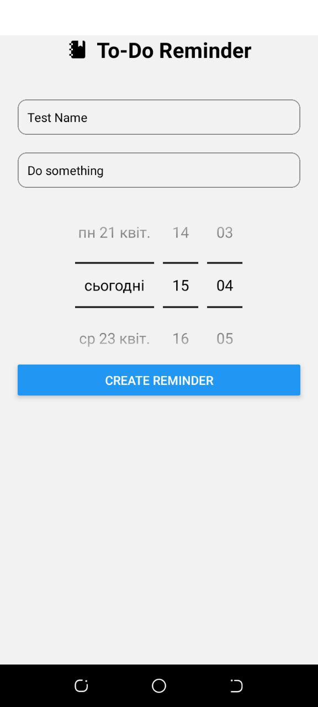

# Welcome to To Do Reminder 👋

Features:

1. Create notification;
2. Review notification;
3. Cancel notification;

## Get started

1. Install dependencies

   ```bash
   npm install
   ```

2. Start the app

   ```bash
    npm run android
   ```

## Screenshots



