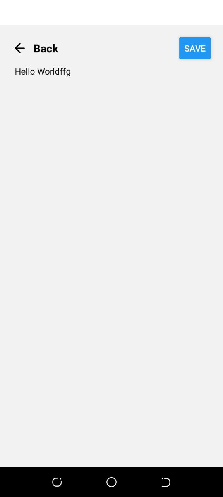
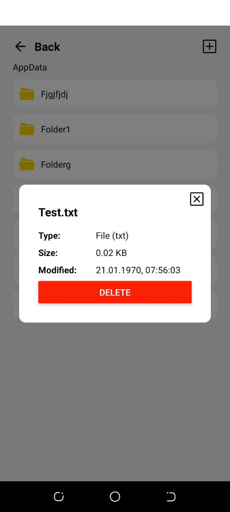
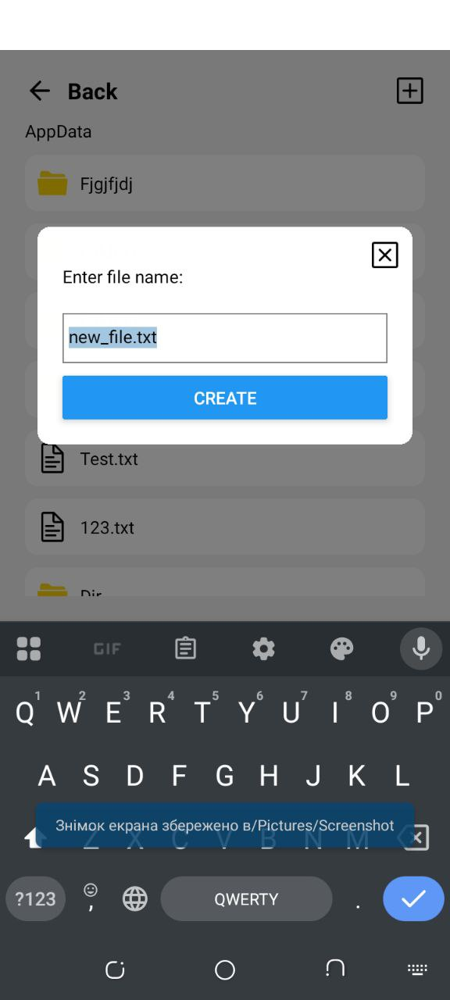
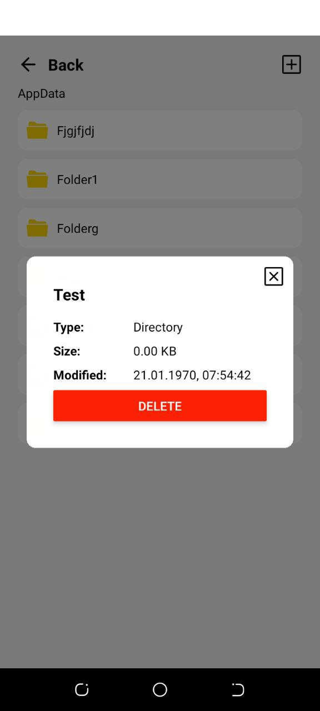
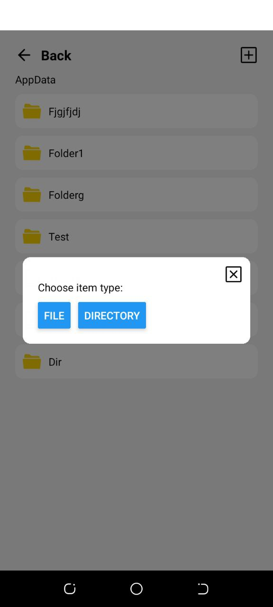
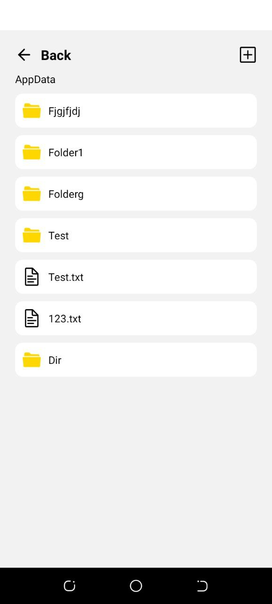
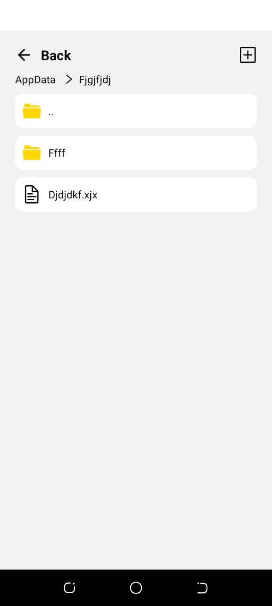
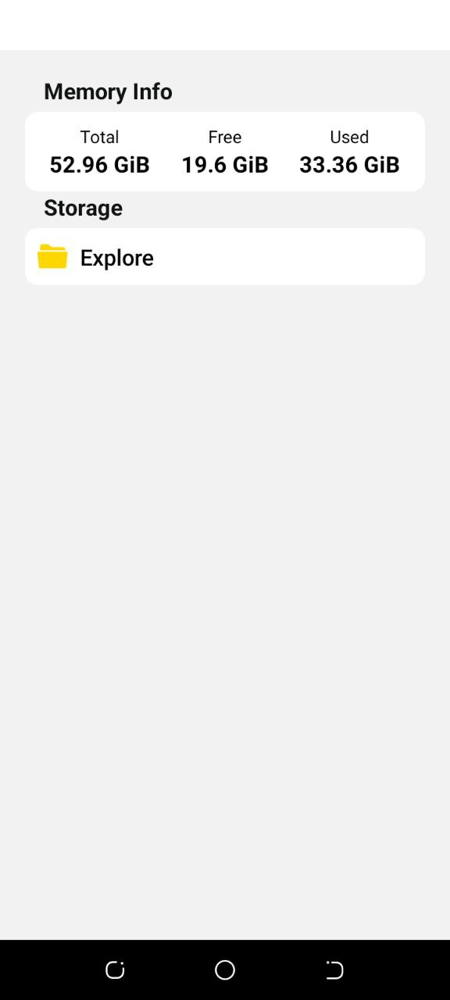

# Welcome to File Explorer👋

The implemented application allows you to work with the local file system and supports:

- navigation between folders;
- creating and editing files;
- viewing file contents;
- deleting files and folders;
- viewing detailed information about file system objects;
- viewing device storage statistics.

## Get started

1. Install dependencies

   ```bash
   npm install
   ```

2. Start the app

   ```bash
    npx expo start
   ```

## Screenshots

       
